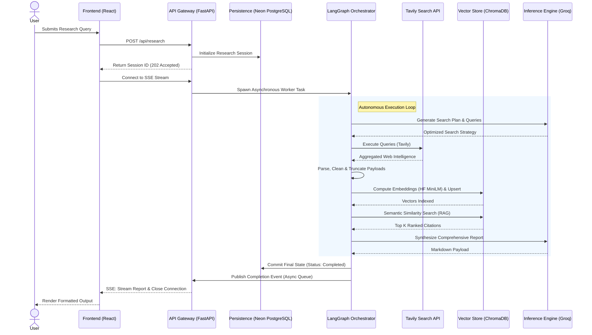

# Aria: Autonomous AI Research Agent

Aria is a high-performance, asynchronous autonomous research agent designed to perform complex investigative tasks. Given a natural language query, the system autonomously formulates multi-step search strategies, aggregates intelligence via the Tavily API, builds a localized Retrieval-Augmented Generation (RAG) vector index, and synthesizes a heavily cited Markdown report.

Engineered for scalability and ultra-low latency, Aria utilizes an event-driven architecture to stream real-time execution graphs directly to the client interface.

---

## System Architecture

Aria's architecture is decoupled into a presentation layer (React 18) and an orchestration layer (FastAPI). The research lifecycle is governed by a deterministic LangGraph state machine.



---

## Core Technical Features

### Asynchronous State Machine
The core intelligence is managed by **LangGraph**, providing a cyclic, state-driven execution pipeline. This allows the agent to plan, execute, evaluate, and synthesize data without blocking the main event loop, ensuring high throughput for concurrent research requests.

### Real-Time Telemetry via Server-Sent Events (SSE)
To maintain a persistent connection with the client without the overhead of WebSockets, Aria leverages an in-memory `asyncio.Queue` Pub/Sub system. Graph execution states (`node_completed`) are broadcasted and streamed to the UI in real time via SSE, providing immediate user feedback.

### Ultra-Low Latency Inference
Inference is powered by the **Groq LPU API** utilizing the `qwen/qwen3.8-27b` model. This allows for near-instantaneous routing decisions, query formulation, and synthesis, effectively removing the LLM as a latency bottleneck in the pipeline.

### Deterministic Intelligence Gathering
Web research is strictly delegated to the **Tavily API**, ensuring the agent receives structured, high-quality search results tailored for LLM consumption. Raw payloads are aggressively parsed and truncated before indexing to strictly manage token contexts and embedding computational overhead.

### Ephemeral RAG Indexing
Data retrieved by Tavily is dynamically chunked and embedded using localized **HuggingFace** models (`all-MiniLM-L6-v2`) via `sentence-transformers`. Vectors are immediately upserted to a managed **ChromaDB** instance, providing highly relevant, context-aware semantic search capabilities for the final synthesis phase.

---

## Technology Stack

### Presentation Layer
* **Framework:** React 18 (Vite)
* **Styling:** Tailwind CSS + Framer Motion
* **Network:** Native Fetch + `EventSource` API

### Orchestration Layer
* **Framework:** FastAPI (Python 3.12)
* **State Management:** LangGraph + LangChain
* **Concurrency:** Native `asyncio` background tasks

### Data & Intelligence Layer
* **Inference Engine:** Groq API (`qwen/qwen3.8-27b`)
* **Embedding Model:** HuggingFace `all-MiniLM-L6-v2`
* **Vector Database:** ChromaDB Cloud
* **Relational Database:** Neon Serverless PostgreSQL (via `asyncpg`)
* **Search Engine:** Tavily API

---

## Local Development Initialization

### 1. Backend Configuration
```bash
# Clone the repository
git clone https://github.com/YourUsername/Aria.git
cd Aria

# Initialize and activate the virtual environment
python -m venv backend/.venv
source backend/.venv/bin/activate  # On Windows: .\backend\.venv\Scripts\activate

# Install strictly defined production dependencies
pip install -r backend/requirements.txt

# Configure Environment Variables
cp .env.example .env
# Edit .env with your respective API credentials (Groq, Tavily, Neon, ChromaDB)

# Boot the ASGI Server
uvicorn backend.main:app --reload --port 8000
```

### 2. Frontend Configuration
```bash
# Open a secondary terminal instance
cd Aria/frontend

# Resolve dependencies
npm install

# Initialize the development server
npm run dev
```
The interface will compile and mount at `http://localhost:5173`. Cross-Origin Resource Sharing (CORS) is bypassed locally via a Vite reverse proxy directing `/api` requests to the ASGI server on port 8000.

---

## Architecture & Optimization Notes

- **Vector Space Hardening:** The ChromaDB collections are strictly mapped to `384` dimensions to natively support the localized HuggingFace embeddings. This architectural decision eliminates reliance on rate-limited, third-party embedding APIs.
- **Memory Management:** SSE subscriptions are designed to dynamically attach and detach from the `ResearchEventManager` upon connection closure, explicitly preventing dangling coroutines or memory leaks during high-load periods.
- **Connection Resiliency:** The asynchronous HTTP clients (`httpx`) wrapping the Groq and Tavily APIs implement robust exponential backoff protocols, handling upstream `HTTP 429 Too Many Requests` seamlessly without failing the execution graph.
- **Database Safety:** All PostgreSQL transactions are executed via SQLAlchemy's async ORM, enforcing strict parameter binding to mitigate SQL injection vectors.
