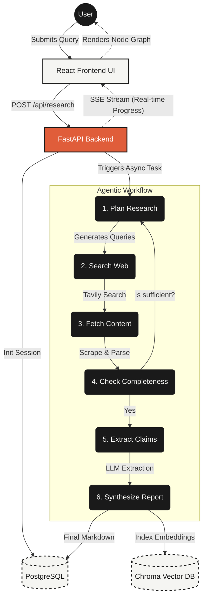

# Aria: Autonomous AI Research Agent

Aria is a high-performance, full-stack cognitive research system. It leverages an autonomous agentic architecture to take a single user query, formulate research plans, scrape the web, extract factual claims, and synthesize a comprehensive, cited intelligence report. 

## System Architecture

Aria is split into a React frontend and a FastAPI backend. The entire pipeline is heavily optimized for speed and throughput, using asynchronous I/O and streaming server-sent events (SSE) to deliver real-time feedback to the UI.

### Data Flow & Execution Workflow

The system utilizes a directed acyclic graph (via LangGraph) to orchestrate the research nodes.



### Performance Engineering

We specifically architected Aria to reduce latency in agentic workflows. Instead of standard sequential LLM chains, we achieved massive speed increases through:

1. **Massive Concurrency:** All web scraping and claim extraction nodes run concurrently using Python's `asyncio.gather` and semaphores, allowing us to process 20+ sources in parallel rather than blocking sequentially.
2. **High-Throughput Reasoning:** We utilize `gemini-3.5-flash` as the core reasoning engine. By moving to the Flash tier, we dramatically cut down generation time while maintaining structured Pydantic output capabilities.
3. **In-Memory Event Queues:** For local execution, the backend bypasses Redis and Celery, using native Python `asyncio.Queue` to push state changes to the Server-Sent Events (SSE) endpoint with zero networking overhead. 
4. **Optimized Frontend Rendering:** The UI utilizes `framer-motion` for fluid state transitions and hardware-accelerated SVG animations, ensuring that the heavy DOM updates from the streaming report do not drop frames.

## Tech Stack

**Frontend:**
- React (Vite)
- TailwindCSS (Custom Bone/Charcoal theme)
- Framer Motion (SVG Node Graph, Layout Animations)
- Lucide React (Icons)

**Backend:**
- Python 3.12
- FastAPI & Uvicorn
- LangGraph (Agent Orchestration)
- Google GenAI SDK (Gemini 3.5 Flash)
- PostgreSQL + asyncpg + SQLAlchemy (State persistence)
- ChromaDB (RAG Vector Store for follow-ups)

## Setup & Execution

### Prerequisites
- Python 3.12+
- Node.js 18+
- PostgreSQL database (or NeonDB connection string)
- API Keys: Gemini, Tavily

### 1. Backend

```bash
cd backend
python -m venv .venv
.\.venv\Scripts\activate
pip install -r requirements.txt

# Create a .env file with:
# GEMINI_API_KEY=...
# TAVILY_API_KEY=...
# DATABASE_URL=postgresql+asyncpg://...

uvicorn backend.main:app --reload --port 8000
```

### 2. Frontend

```bash
cd frontend
npm install
npm run dev
```

Navigate to `http://localhost:5173` to use the application.

---

*Note: This project is proprietary. No open-source license is provided.*
